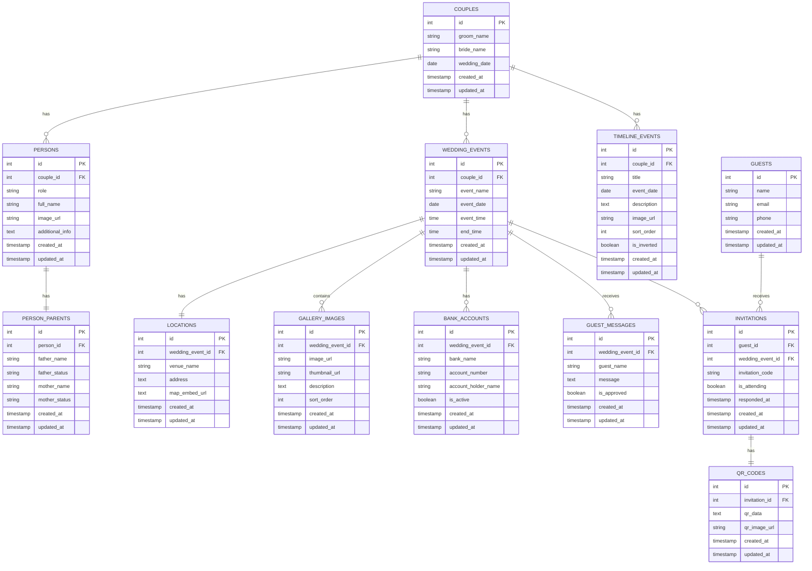

```mermaid
erDiagram
    COUPLES ||--o{ PERSONS : "has"
    PERSONS ||--|| PERSON_PARENTS : "has"
    COUPLES ||--o{ WEDDING_EVENTS : "has"
    WEDDING_EVENTS ||--|| LOCATIONS : "has"
    WEDDING_EVENTS ||--o{ GALLERY_IMAGES : "contains"
    COUPLES ||--o{ TIMELINE_EVENTS : "has"
    WEDDING_EVENTS ||--o{ BANK_ACCOUNTS : "has"
    WEDDING_EVENTS ||--o{ GUEST_MESSAGES : "receives"
    GUESTS ||--o{ INVITATIONS : "receives"
    WEDDING_EVENTS ||--o{ INVITATIONS : "sends"
    INVITATIONS ||--|| QR_CODES : "has"

    COUPLES {
        int id PK
        string groom_name
        string bride_name
        date wedding_date
        timestamp created_at
        timestamp updated_at
    }

    PERSONS {
        int id PK
        int couple_id FK
        string role
        string full_name
        string image_url
        text additional_info
        timestamp created_at
        timestamp updated_at
    }

    PERSON_PARENTS {
        int id PK
        int person_id FK
        string father_name
        string father_status
        string mother_name
        string mother_status
        timestamp created_at
        timestamp updated_at
    }

    WEDDING_EVENTS {
        int id PK
        int couple_id FK
        string event_name
        date event_date
        time event_time
        time end_time
        timestamp created_at
        timestamp updated_at
    }

    LOCATIONS {
        int id PK
        int wedding_event_id FK
        string venue_name
        text address
        text map_embed_url
        timestamp created_at
        timestamp updated_at
    }

    GALLERY_IMAGES {
        int id PK
        int wedding_event_id FK
        string image_url
        string thumbnail_url
        text description
        int sort_order
        timestamp created_at
        timestamp updated_at
    }

    TIMELINE_EVENTS {
        int id PK
        int couple_id FK
        string title
        date event_date
        text description
        string image_url
        int sort_order
        boolean is_inverted
        timestamp created_at
        timestamp updated_at
    }

    BANK_ACCOUNTS {
        int id PK
        int wedding_event_id FK
        string bank_name
        string account_number
        string account_holder_name
        boolean is_active
        timestamp created_at
        timestamp updated_at
    }

    GUESTS {
        int id PK
        string name
        string email
        string phone
        timestamp created_at
        timestamp updated_at
    }

    INVITATIONS {
        int id PK
        int guest_id FK
        int wedding_event_id FK
        string invitation_code
        boolean is_attending
        timestamp responded_at
        timestamp created_at
        timestamp updated_at
    }

    QR_CODES {
        int id PK
        int invitation_id FK
        text qr_data
        string qr_image_url
        timestamp created_at
        timestamp updated_at
    }

    GUEST_MESSAGES {
        int id PK
        int wedding_event_id FK
        string guest_name
        text message
        boolean is_approved
        timestamp created_at
        timestamp updated_at
    }
```